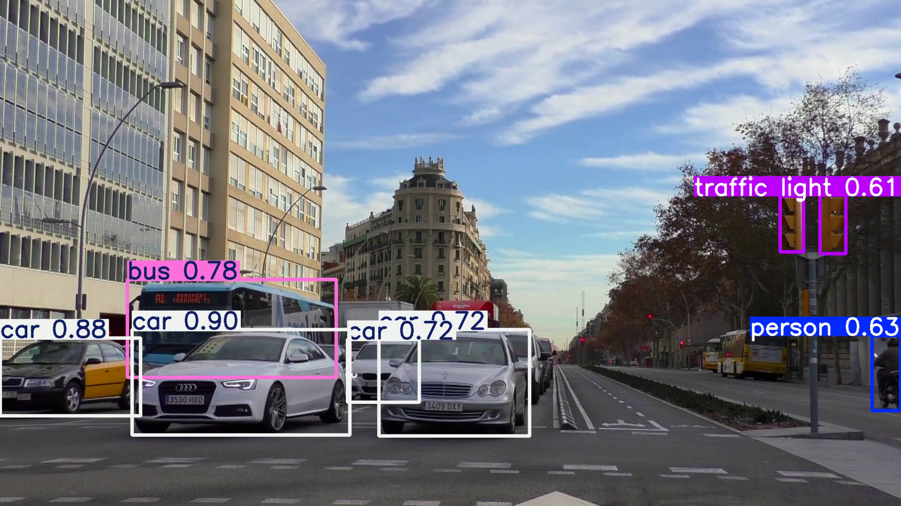
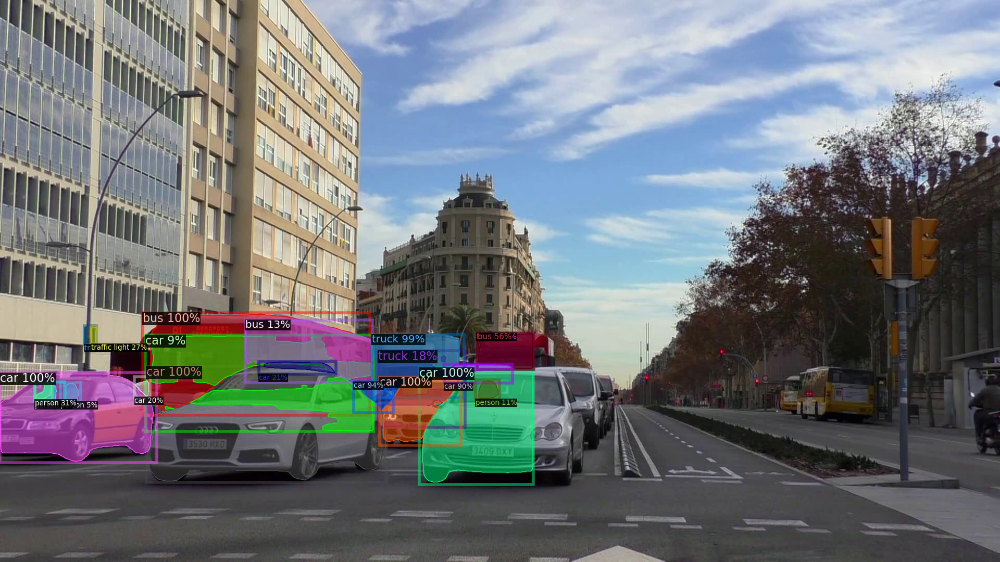
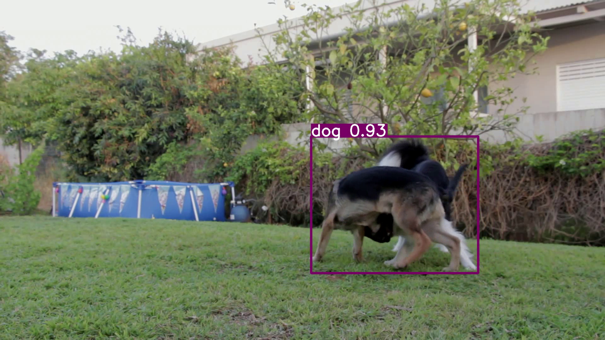
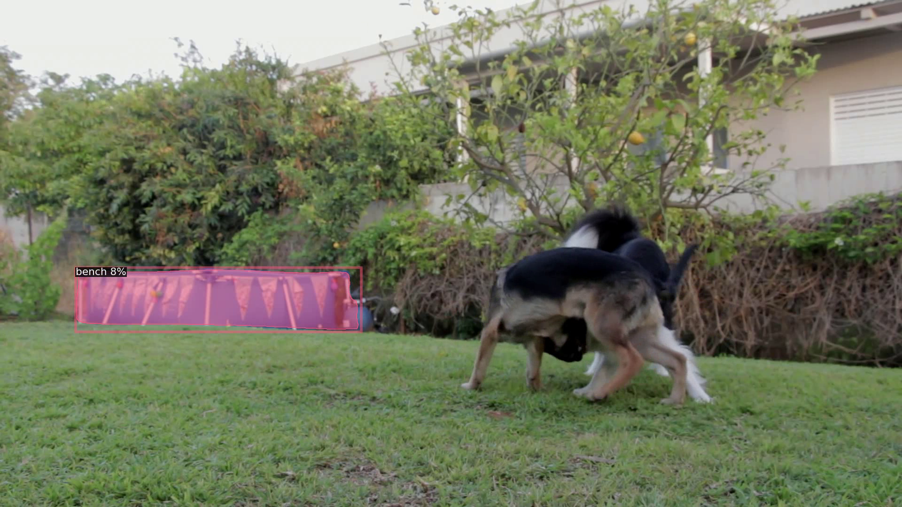
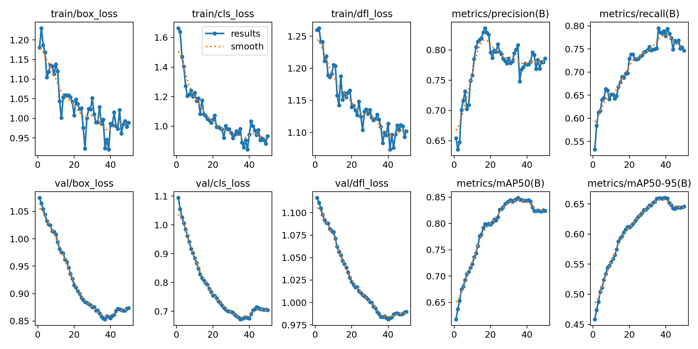
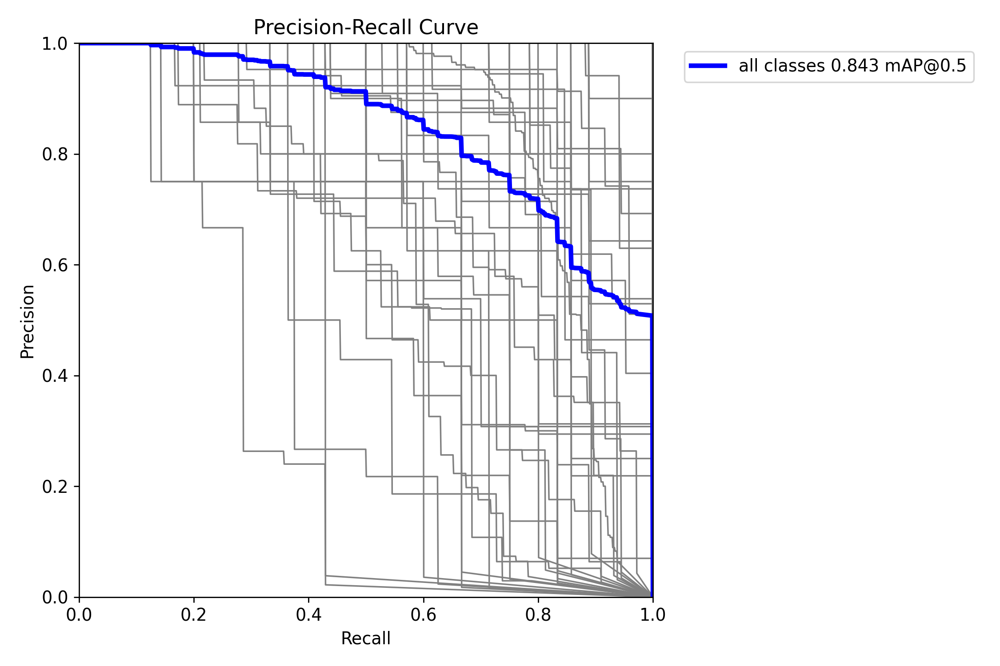
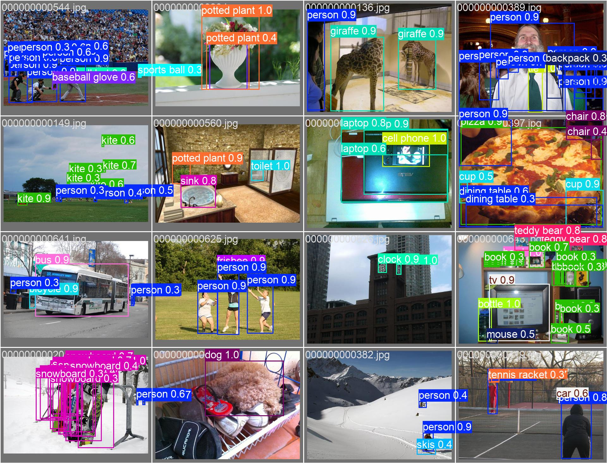

# Object Detection Project Report

This README summarizes the key experiments and results from our object detection project, which covers:

1. **Inference comparison** of YOLOv8 vs. ViTDet on two videos  
2. **Acceleration** experiments using ONNX and TensorRT  
3. **Training** a YOLOv8 model on the COCO128 dataset for 50 epochs  

---

## 1. Inference Comparison: YOLOv8 vs. ViTDet

We ran both models on **two sample videos**, captured their demo outputs, and measured per-frame inference time. Results below (see `*.benchmark.txt` files for full logs).

| Video     | Model   | Frames | Avg. Latency (ms) | Throughput (FPS) |
|-----------|---------|:------:|-------------------:|-----------------:|
| **video1** | YOLOv8  | 495    | 62.7              | 15.9             |
|            | ViTDet  | 495    | 1365.6            | 0.7              |
| **video2** | YOLOv8  | 319    | 45.6              | 21.9             |
|            | ViTDet  | 319    | 836.7             | 1.2              |

### 1.1 Demo Outputs

- **Video 1, YOLOv8**
  
  [Watch the video](output/video_inference/video1_yolo_result.mp4)

- **Video 1, ViTDet**
  
  [Watch the video](output/video_inference/video1_vitdet_demo.mp4)

- **Video 2, YOLOv8**
  
  [Watch the video](output/video_inference/video2_yolo_result.mp4)

- **Video 2, ViTDet**  
  
  [Watch the video](output/video_inference/video2_vitdet_demo.mp4)

*Discussion:*  
YOLOv8 achieves real‑time or near‑real‑time performance (15–22 FPS) on these videos, while ViTDet—despite better accuracy on static images—runs at sub‑2 FPS on the same hardware.  

---

## 2. Acceleration with ONNX & TensorRT

To boost inference speed, we export our yolov8 models to ONNX and build TensorRT engines. We compare:

- **Baseline PyTorch** (results above)  
- **ONNX Runtime**  
- **TensorRT**  

| YOLOv8 |     PyTorch |     ONNX |     TensorRT |
|:------:|------------:|---------:|-------------:|
|  FPS   |        15.9 |     17.67 |         22.7 |
|  acc   |             |          |              |

### 2.1 Workflow

1. **Export** PyTorch → ONNX (`torch.onnx.export`)  
2. **Optimize** ONNX → TensorRT engine (Python API)  
3. **Benchmark** with same video inputs and timer code  
<!--
### 2.2 Results & Plots

- **ONNX vs. PyTorch Demo (YOLOv8)**  
  

- **TensorRT vs. PyTorch Demo (YOLOv8)**  
  

- **Performance Comparison Plot**  
  

*Discussion:*  
**
-->
---

## 3. Training YOLOv8 on COCO128 (50 epochs)

We trained a YOLOv8n model from scratch on the **COCO128** dataset for **50 epochs**. Below are the final validation metrics and training curve.

```json
{
  "Precision": 0.77199,
  "Recall":    0.78430,
  "mAP_50":    0.84125,
  "mAP_50_95": 0.65797,
  "F1_per_class": [
    0.82016, 0.58473, 0.53911, 0.96014, 0.95552, 0.89625, 0.90596, 0.62609,
    … (truncated for brevity) …
    0.74252, 0.88683
  ]
}
```
### 3.2 Training Curves
- **results**
  

- **PR curve**
  

### 3.2 Demo Outputs

- **YOLOv8**
  


## References
1. YOLOv8 – Ultralytics official documentation: https://docs.ultralytics.com
2. Detectron2 / ViTDet – Facebook AI Research: https://github.com/facebookresearch/detectron2/tree/main/projects/ViTDet
3. ONNX Runtime – Microsoft: https://onnxruntime.ai
4. TensorRT – NVIDIA: https://developer.nvidia.com/tensorrt
5. COCO Dataset – Common Objects in Context: https://cocodataset.org
6. Ultralytics COCO128 – Sample dataset YAML: https://github.com/ultralytics/ultralytics/blob/main/ultralytics/cfg/datasets/coco128.yaml
7. Video capture: https://github.com/lkk688/VisionLangAnnotate/blob/main/backend/src/extractframefromvideo.py
8. Inference code:  https://github.com/lkk688/DeepDataMiningLearning/blob/main/DeepDataMiningLearning/vision/myvisioninference_class.py
9. Training code: https://github.com/lkk688/VisionLangAnnotate/blob/main/ModelDev/multimodels.py